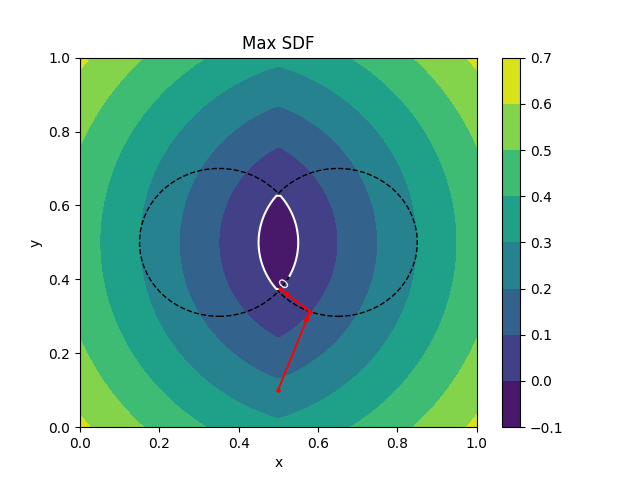

# SimSDF: Physically-Based Simulation with Signed Distance Field



This repository contains an implementation for the CS5643 final project, coded by Zichen Wang, Barry Lyu, and Xilai Dai.

## Environment
The environment setup for this repository is fairly simple. Run  
``` pip install numpy taichi matplot ```

## Code Structure
Here is a breakdown of the repository to facilitate better comprehension of our codes.  
`main.py` is the primary entry pooint. It is also where the initial scene is delcared.  
`util.py` combines configures with common functions.  
`scene.py` contains the `Scene` class.  
`shape.py` contains the supported object classes. Refer to the `Object` class as an interface for all objects.  
 `gui.py` implements the GUI.  
 `maxsdf.py` generates the illustrative figure shown above.
